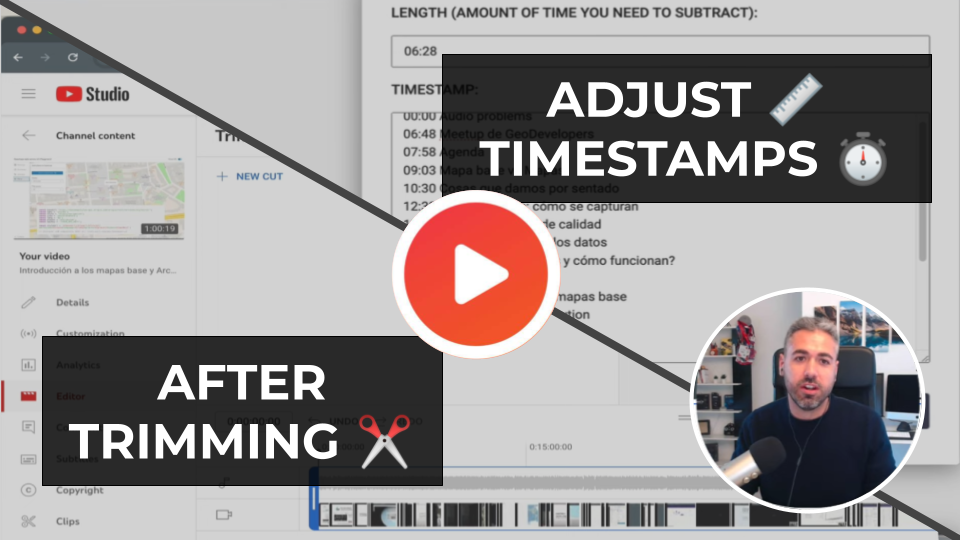

This is an interface to help you adjust your video timestamps you use to create the [chapters](https://support.google.com/youtube/answer/9884579?hl=en) after trim and cut using the YouTube viddeo editor

